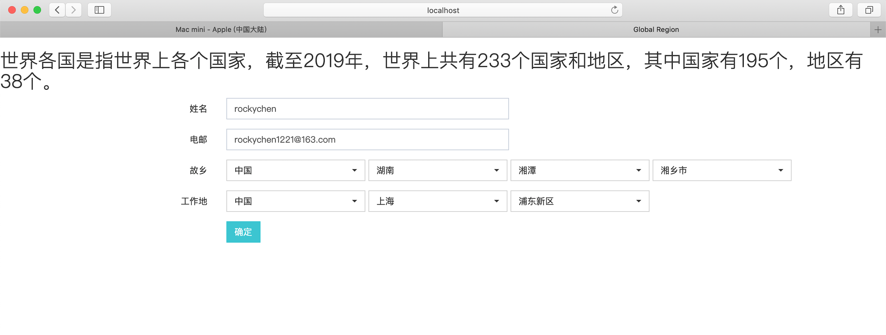

# GlobalRegion 简介

世界各国是指世界上各个国家，截至2019年，世界上共有233个国家和地区，其中国家有195个，地区有38个。

数据较全，体验较好，支持快速接入，根据上级查找附属直接下级，支持检索以及默认值初始化赋值（本example默认：中国/湖南/湘潭/湘乡市）

支持中英文国际化，通过[pinyin4j-example](https://github.com/rockychen1221/pinyin4j-example)获取地区数据国际化

级联格式依次为：国家（地区）/省份（直辖市）/市（区）/县，效果如图

## 本实例依赖以下插件或库，可根据实际使用进行调整修改
* jQuery
* BootStrap 3
* BootStrap Select
> 考虑到同一个页面会有多个地区应用场景，比如故乡和工作地，故Ajax请求发送设置为同步，可根据需要调整

## 如何运行
* Step 1. 在您的数据库中执行`sql`目录中的脚本，`d_area`为地区层级，`sys_lang`为国际化，更换应用数据库连接信息
* Step 2. 使用`mvn spring-boot:run`,启动后浏览器访问`http://localhost:8080`

## 如何接入使用
* Step 1. 自定义地区下拉元素页面布局，根据实际页面比例预留长度，声明下拉元素ID（需在Step 3 初始化传入，如使用默认ID:fromArea，即可不传）
* Step 2. 在您自己的页面引入`area.js`
* Step 3. 调用`Area.initFromArea();` ,初始化即可接入使用

## 数据欢迎补充维护

## Next
1. 目前脚本查询到的一级国家/地区共有240个，哪多冒出来7个。。。需要进行核对，和外交部一致
2. 将地区数据做成地图图表，支持下钻
